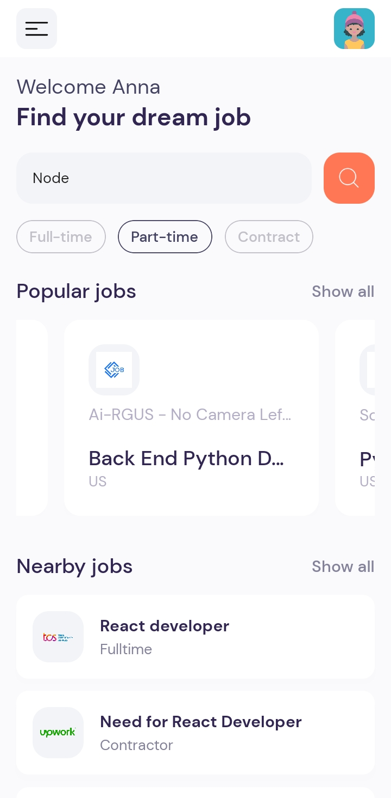
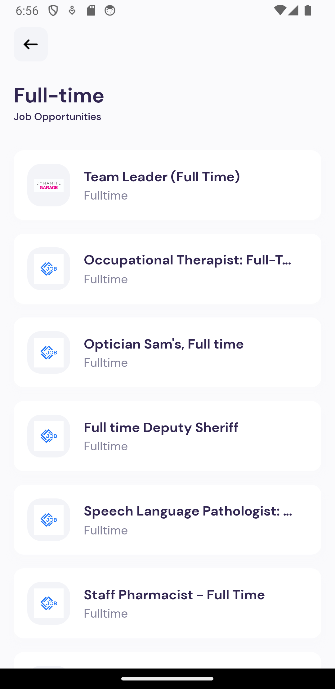
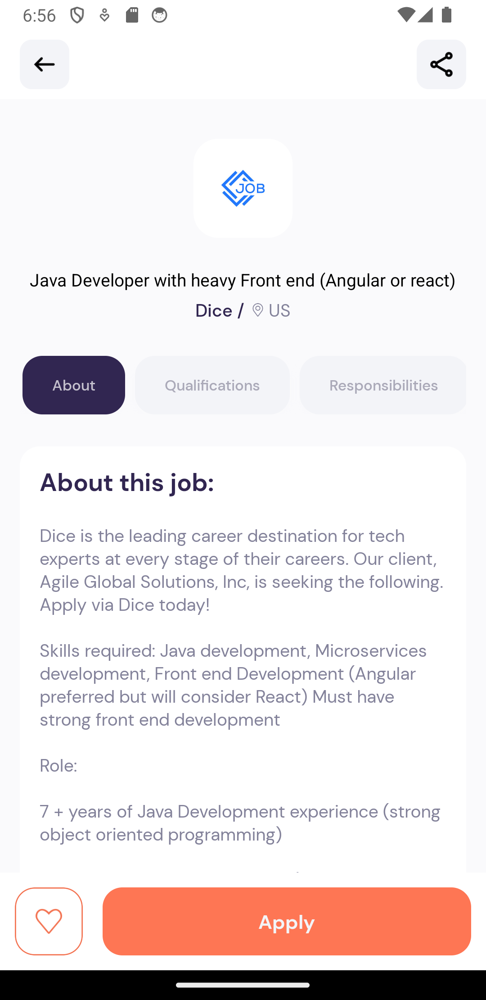

# #️⃣Mobile Project - Job Search App

## Table of contents

- [#️⃣Mobile Project - Job Search App](#️⃣mobile-project---job-search-app)
  - [Table of contents](#table-of-contents)
  - [Overview](#overview)
  - [🛠️Core Features](#️core-features)
    - [📸Screenshots](#screenshots)
    - [🔗Links](#links)
    - [⚙️Built with](#️built-with)
    - [👨‍💻Continued development](#continued-development)
  - [Author](#author)

## Overview

A mobile application for job search with a visually pleasing interface.

## 🛠️Core Features

▶️ Dynamic Home page.

▶️ Third Party API integration.

▶️ Browse and search for various jobs across the global.

▶️ Search & Pagination Functionality.

▶️ Apply to your dream Job.

### 📸Screenshots

 <video controls="controls">
  <source type="video/mp4" src="./screenshots/Screenrecord2.mp4"></source>
  
Your browser does not support the video element.

</video>

### 🔗Links

- GitHub Repo: [View Repo](https://github.com/Gandah/jobs-mobile-app.git)

### ⚙️Built with

- Node.js
- React Native
- Axios
- Expo
- JSearch API

### 👨‍💻Continued development

- Add skeleton loaders

## Author

- LinkedIn - [MyLinkedIn](https://www.linkedin.com/in/gandahkelvin)
- Website - [Portfolio](https://gandah-porfolio.vercel.app/)
- Twitter - [@mr_g4nderson](https://twitter.com/mr_g4nderson?t=A5NobjZab2sVEdh3Zq9s0A&s=09)
